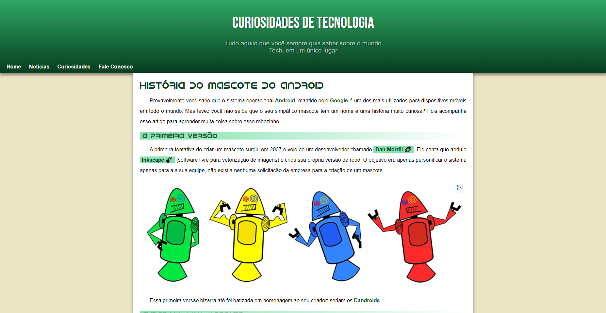

<h1>Projeto Android 🤖</h1> 

Desafio do curso de HTML e CSS do Curso em Vídeo

    Essa versão foi criada junto com o professor guanabara durante o capítulo 17 do módulo 02 do curso de HTML e CSS

<h2> Exercício Proposto: 🕵️ </h2>

    Replicamos o site que ele havia nos apresentado no inicio do Módulo 02

    Aponte a câmera do celular para o QR Code e tenha acesso ao desafio no repositório do professor Guanabra 👉

<h2> Tecnologias Utilizadas: 👩‍💻 </h2>
  <ul> 
    <li>HTML5</li>
    <li>CSS3</li>
  </ul>

  <h2> Projeto Finalizado ✅ </h2>
  
 
Link do Projeto: <a href="https://g4breela.github.io/projeto-android/">https://g4breela.github.io/projeto-android/</a>

